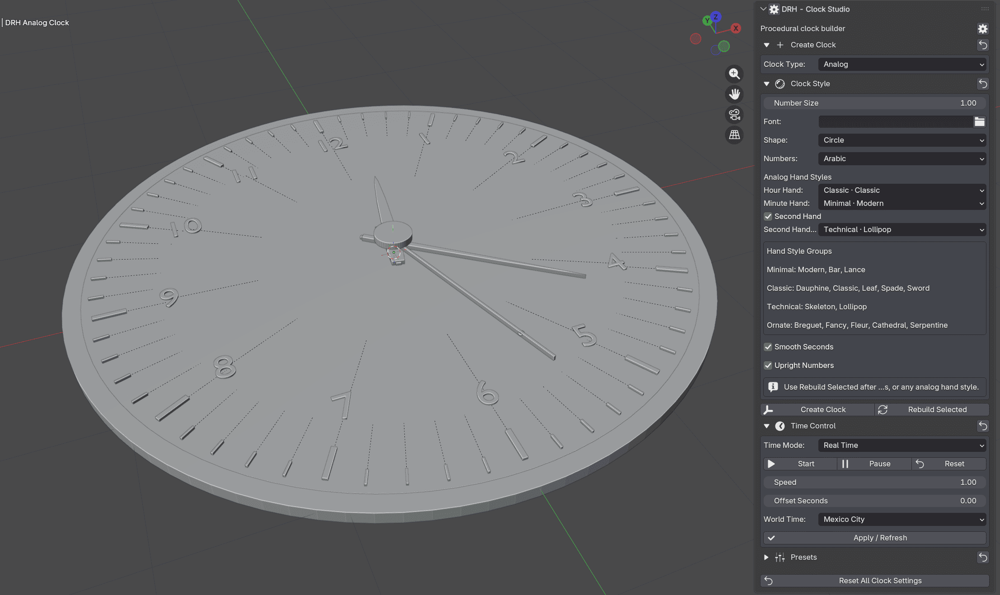

  

 

# DRH - Clock Studio

### Public Support Hub · Documentation · Feedback · Pre-release Validation

**A Blender utility for generating customizable clock meshes with faces, hands, markers, bezels, materials, and scene-ready variations.**

 

**Part of the DRH Add-ons ecosystem — Blender tools, updates, and releases.**

<!--

-->

---

**DRH - Clock Studio** helps Blender users create customizable clock assets for interiors, product visualization, game props, animation, tabletop scenes, architectural renders, and stylized environments.

This repository is the central public hub for support, documentation, issue tracking, compatibility feedback, and community validation before marketplace release.

---

  
<strong>📚 Table of Contents</strong>

## Menu

- [Overview](#overview)
- [Media preview](#media-preview)
- [What DRH - Clock Studio does](#what-drh---clock-studio-does)
- [Key features](#key-features)
- [Full feature list](#full-feature-list)
- [Who is it for?](#who-is-it-for)
- [Current status](#current-status)
- [Feedback wanted before release](#feedback-wanted-before-release)
- [Quick links](#quick-links)
- [Before you post](#before-you-post)
- [Where to post](#where-to-post)
- [Support policy](#support-policy)
- [Technical notes](#technical-notes)
- [Availability](#availability)
- [Documentation](#documentation)
- [License](#license)

---

## Overview

**DRH - Clock Studio** is a Blender workflow utility designed to help users generate customizable clock assets directly inside Blender.

It is intended for environment artists, product visualization artists, interior designers, prop artists, game artists, animation creators, architectural visualization users, asset pack creators, and Blender users who need clock models for renders, scenes, prototypes, or stylized collections.

Instead of modeling every clock manually from scratch, DRH - Clock Studio helps turn clock creation into a faster, more adjustable, and repeatable workflow.

## Media preview

<!--

---

### Demo video

Replace `YOUTUBE_VIDEO_ID` with your real YouTube video ID.

Example:
https://www.youtube.com/watch?v=YOUTUBE_VIDEO_ID

  
   
  Click the image to watch the demo on YouTube.

-->

<!--
### Quick demo GIF

Recommended size: 1280x720 or 960x540.

  

-->

### Early Screenshots

| Clock Generator Controls |
|---|
|  |

<!--

  
<strong>More Screenshots...</strong>

| Clock Body Controls | Dial & Hand Controls |
|---|---|
|  |  |

-->

<!--
### Visual preview

Use this section if you want one large image instead of a gallery.

  

-->

<!--
Temporary placeholder while media is not available.

Media preview coming soon.

-->

---

## What DRH - Clock Studio does

DRH - Clock Studio helps you create, customize, and refine clock assets directly inside Blender.

It is not only a simple clock preset tool. It is designed as a workflow helper for generating clock meshes, selecting clock styles, configuring the body and dial, adjusting hands and markers, applying color presets, and preparing clock variations for creative or production use.

Use it to:

- Generate clock assets faster
- Create wall clocks, tabletop clocks, decorative clocks, and stylized clock props
- Configure clock body shape, depth, bevels, and proportions
- Build clock faces with markers, numbers, labels, or clean minimal layouts
- Adjust hour, minute, and second hands
- Create static display times for renders and product shots
- Apply predefined or custom color presets
- Control materials for body, dial, hands, markers, and details
- Build clock variations for interiors, game scenes, renders, prototypes, or asset packs

---

### Key Features

- One-click generation of customizable clock meshes directly in Blender
- Clock asset workflow for wall, desk, decorative, and stylized clock use cases
- Body-shaping controls for clean, polished clock forms
- Flexible dial system for numbers, markers, labels, and minimal faces
- Adjustable hour, minute, and second hands
- Static time controls for render-ready clock displays
- Built-in color presets plus custom color control
- Material controls for body, dial, hands, markers, and accents
- Useful for interior scenes, architectural visualization, game props, animation, and product renders

---

  
<strong>🧩 Full feature list</strong>

## Full feature list

### Clock Generation

- Mesh-based clock generation
- In-scene clock creation workflow
- Reusable clock assets for packs, renders, scenes, and prototypes
- Fast clock variation workflow
- Scene-ready prop generation

### Clock Types

- Wall clock style
- Table clock style
- Desk clock style
- Minimal clock style
- Decorative clock style
- Modern clock style
- Classic clock style
- Stylized prop clock style
- Custom clock generator workflow

### Body & Geometry

- Size controls
- Depth controls
- Bevel radius controls
- Bevel segment controls
- Roundness controls
- Body profile controls
- Clock frame controls
- Inner dial controls
- Outer rim controls
- Backplate controls
- Center cap controls
- Proportion controls
- Clean mesh generation for render-ready use

### Dial & Face

- Clock face generation
- Dial radius controls
- Dial inset controls
- Dial thickness controls
- Clean face layout
- Minimal face layout
- Numbered face layout
- Marker-based face layout
- Custom label support
- Roman numeral support
- Arabic numeral support
- Blank dial support
- Decorative face support

### Markers & Numbers

- Hour marker controls
- Minute marker controls
- Marker length controls
- Marker width controls
- Marker depth controls
- Marker scale controls
- Number scale controls
- Number offset controls
- Number rotation controls
- Font selection support
- Custom text support
- Optional 12-hour layout
- Optional marker-only layout
- Optional number-only layout

### Hands

- Hour hand generation
- Minute hand generation
- Second hand generation
- Hand length controls
- Hand width controls
- Hand thickness controls
- Hand shape controls
- Hand offset controls
- Center pin / center cap controls
- Static display time controls
- Adjustable hour value
- Adjustable minute value
- Adjustable second value
- Render-ready hand placement

### Styles & Variations

- Modern clock variations
- Classic clock variations
- Minimal clock variations
- Decorative clock variations
- Product render variations
- Interior scene variations
- Game prop variations
- Asset pack variation workflow

### Color Workflow

- Built-in color presets
- Preset preview thumbnails
- Custom body color
- Custom dial color
- Custom hand color
- Custom marker color
- Custom number color
- Accent color controls
- Swap color workflow
- Apply colors to selected clocks

### Materials

- Body material controls
- Dial material controls
- Hand material controls
- Marker material controls
- Number material controls
- Center cap material controls
- Metallic-style material support
- Matte-style material support
- High-contrast face setup for readable renders

### Workflow & UI

- Reset defaults
- Settings popup
- Preferences access
- Dedicated sections for body, dial, hands, colors, and style controls
- Fast iteration workflow
- Support for selected-object color updates
- Workflow-friendly organization for repeated clock creation

---

## Who is it for?

DRH - Clock Studio is designed for:

- Blender users
- Environment artists
- Interior visualization artists
- Architectural visualization users
- Product visualization artists
- Game artists
- Prop designers
- Animation creators
- Motion graphics artists
- Stylized scene artists
- Marketplace asset creators
- Users who need reusable clock assets, clock variations, prototypes, or decorative props

---

## Current status

| Item | Details |
|---|---|
| **Status** | 🟣 In Development |
| **Current version** | 1.0.0 |
| **Minimum Blender version** | 4.2.0 |
| **Platforms** | Windows, macOS, Linux |
| **Release type** | In development before public marketplace release |
| **Support repository** | [DRH Clock Studio Support](https://github.com/pacosalasv/DRH_clock_studio-Support) |

This add-on is currently in development. Compatibility feedback, usability comments, feature expectations, and workflow suggestions are welcome before public release.

---

## Feedback wanted before release

This repository is open for public feedback before marketplace release.

Feedback is especially welcome on:

- Feature usefulness
- Clock style expectations
- Dial and marker workflows
- Number and label readability
- Hand shape and time-setting controls
- Body shape controls
- Color preset expectations
- Interior visualization use cases
- Game prop workflow expectations
- Animation workflow expectations
- 3D printing workflow expectations
- Compatibility concerns
- Installation experience
- Documentation clarity
- Expected pricing
- Marketplace expectations

Useful feedback examples:

> “I would use this to generate clock props for interior renders.”

> “I need a fast way to make multiple clock variations for asset packs.”

> “I need the clock numbers and markers to stay readable in close-up renders.”

> “This should support clean modern clock faces and classic Roman numeral faces.”

> “The hand controls should make it easy to set a specific time for a render.”

> “This would be useful if the generated meshes are easy to export for game scenes.”

---

## Quick links

- [Support repository](https://github.com/pacosalasv/DRH_clock_studio-Support)
- [Ask a question in Discussions](https://github.com/pacosalasv/DRH_clock_studio-Support/discussions)
- [Open a new issue](https://github.com/pacosalasv/DRH_clock_studio-Support/issues/new/choose)
- [Report a bug](https://github.com/pacosalasv/DRH_clock_studio-Support/issues/new?template=bug_report.yml)
- [Request a feature](https://github.com/pacosalasv/DRH_clock_studio-Support/issues/new?template=feature_request.yml)
- [Report a compatibility issue](https://github.com/pacosalasv/DRH_clock_studio-Support/issues/new?template=compatibility_issue.yml)

---

## Before you post

Please include as much of the following information as possible:

- Add-on version
- Blender version
- Operating system
- Installation method
- Clear steps to reproduce
- Expected result
- Actual result
- Error message, screenshot, or console output when available

For compatibility issues, please also include:

- Blender build type, if known
- Portable or installed Blender version
- Whether the issue happens with a clean Blender configuration
- Clock type involved, if relevant
- Dial type involved, if relevant
- Marker type involved, if relevant
- Hand type involved, if relevant
- Color preset involved, if relevant
- Whether the issue involves mesh generation, dial layout, markers, numbers, hands, body controls, color presets, export, animation, or 3D printing preparation
- Scene complexity, if relevant

---

## Use Discussions for

- Questions
- How-to topics
- Installation help
- Compatibility checks
- FAQ
- Suggestions
- Pre-release feedback
- Pricing feedback
- Workflow ideas

---

## Use Issues for

- Confirmed bugs
- Reproducible compatibility problems
- Clock generation problems
- Dial, marker, number, or hand placement problems
- Mesh or material issues
- Body control issues
- Color preset issues
- Feature requests
- Regressions
- Marketplace or listing-related problems
- Documentation errors

---

## Where to post

Open a **Discussion** for:

- General questions
- Setup help
- Workflow advice
- Suggestions
- Early feedback

Open an **Issue** for:

- Confirmed bugs
- Reproducible compatibility problems
- Clock generation failures
- Dial, marker, number, hand, material, color, body control, or mesh problems
- Regressions
- Feature requests
- Documentation problems

---

## Support policy

This repository is a public support hub.

Do not post:

- Private account details
- License keys
- Payment information
- Confidential production files
- Private client files
- Sensitive system information

If a private file is required to reproduce an issue, please describe the problem first and wait for further instructions.

---

## Technical notes

This add-on is source based, with:

- No obfuscation
- No binary-only content
- No external services
- No account requirements

Local system access may be used only for normal Blender workflows such as saving files, loading assets, exporting data, or using project resources when applicable.

The add-on is intended to work locally inside Blender.

---

## Availability

This add-on may be available through multiple marketplaces and storefronts after release.

This GitHub repository remains the central public location for:

- Support
- Documentation
- Issue tracking
- Compatibility reports
- Public feedback
- Release notes

---

## Documentation

- [User Manual](docs/manual/user-manual.pdf)
- [Changelog](CHANGELOG.md)

---

## License

This repository is distributed under **GPL-3.0-or-later**.

---

### DRH Add-ons

**Blender tools, updates, and releases.**

Built for clean workflows, practical utilities, and production-friendly Blender setups.

