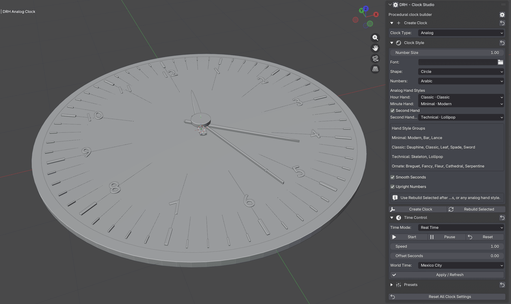

  

 

# DRH - Clock Studio

### Support · Documentation · Feedback · Development On-Hold

Create customizable clock assets for visualization, props, animation, and scene-building workflows.

 

DRH Blender Tools: support, documentation, and release information.

---

DRH - Clock Studio helps Blender users create customizable clock assets for interiors, product visualization, game props, animation, tabletop scenes, architectural renders, and stylized environments.

This repository tracks documentation, support, compatibility reports, and development notes while active development is on hold.

---

## Overview

DRH - Clock Studio is a Blender workflow utility designed to help users generate customizable clock assets directly inside Blender.

It is intended for environment artists, product visualization artists, interior designers, prop artists, game artists, animation creators, architectural visualization users, asset pack creators, and Blender users who need clock models for renders, scenes, prototypes, or stylized collections.

Instead of modeling every clock manually from scratch, DRH - Clock Studio helps turn clock creation into a faster, more adjustable, and repeatable workflow.

## Media preview

### Screenshots

| Clock Generator Controls |
|---|
|  |

---

## What DRH - Clock Studio does

DRH - Clock Studio helps you create, customize, and refine clock assets directly inside Blender.

It is not only a simple clock preset tool. It is designed as a workflow helper for generating clock meshes, selecting clock styles, configuring the body and dial, adjusting hands and markers, applying color presets, and preparing clock variations for creative or production use.

Use it to:

| Details |
|---|
| Generate clock assets faster |
| Create wall clocks, tabletop clocks, decorative clocks, and stylized clock props |
| Configure clock body shape, depth, bevels, and proportions |
| Build clock faces with markers, numbers, labels, or clean minimal layouts |
| Adjust hour, minute, and second hands |
| Create static display times for renders and product shots |
| Apply predefined or custom color presets |
| Control materials for body, dial, hands, markers, and details |
| Build clock variations for interiors, game scenes, renders, prototypes, or asset packs |

---

### Capabilities

| Details |
|---|
| One-click generation of customizable clock meshes directly in Blender |
| Clock asset workflow for wall, desk, decorative, and stylized clock use cases |
| Body-shaping controls for clean, polished clock forms |
| Flexible dial system for numbers, markers, labels, and minimal faces |
| Adjustable hour, minute, and second hands |
| Static time controls for render-ready clock displays |
| Built-in color presets plus custom color control |
| Material controls for body, dial, hands, markers, and accents |
| Useful for interior scenes, architectural visualization, game props, animation, and product renders |

---

  
Feature reference

## Feature reference

### Clock generation
| Details |
|---|
| Mesh-based clock generation |
| In-scene clock creation workflow |
| Reusable clock assets for packs, renders, scenes, and prototypes |
| Fast clock variation workflow |
| Scene-ready prop generation |

### Clock types
| Details |
|---|
| Wall clock style |
| Table clock style |
| Desk clock style |
| Minimal clock style |
| Decorative clock style |
| Modern clock style |
| Classic clock style |
| Stylized prop clock style |
| Custom clock generator workflow |

### Body and geometry
| Details |
|---|
| Size controls |
| Depth controls |
| Bevel radius controls |
| Bevel segment controls |
| Roundness controls |
| Body profile controls |
| Clock frame controls |
| Inner dial controls |
| Outer rim controls |
| Backplate controls |
| Center cap controls |
| Proportion controls |
| Clean mesh generation for render-ready use |

### Dial and face
| Details |
|---|
| Clock face generation |
| Dial radius controls |
| Dial inset controls |
| Dial thickness controls |
| Clean face layout |
| Minimal face layout |
| Numbered face layout |
| Marker-based face layout |
| Custom label support |
| Roman numeral support |
| Arabic numeral support |
| Blank dial support |
| Decorative face support |

### Markers and numbers
| Details |
|---|
| Hour marker controls |
| Minute marker controls |
| Marker length controls |
| Marker width controls |
| Marker depth controls |
| Marker scale controls |
| Number scale controls |
| Number offset controls |
| Number rotation controls |
| Font selection support |
| Custom text support |
| Optional 12-hour layout |
| Optional marker-only layout |
| Optional number-only layout |

### Hands

| Details |
|---|
| Hour hand generation |
| Minute hand generation |
| Second hand generation |
| Hand length controls |
| Hand width controls |
| Hand thickness controls |
| Hand shape controls |
| Hand offset controls |
| Center pin / center cap controls |
| Static display time controls |
| Adjustable hour value |
| Adjustable minute value |
| Adjustable second value |
| Render-ready hand placement |

### Styles and variations
| Details |
|---|
| Modern clock variations |
| Classic clock variations |
| Minimal clock variations |
| Decorative clock variations |
| Product render variations |
| Interior scene variations |
| Game prop variations |
| Asset pack variation workflow |

### Color workflow
| Details |
|---|
| Built-in color presets |
| Preset preview thumbnails |
| Custom body color |
| Custom dial color |
| Custom hand color |
| Custom marker color |
| Custom number color |
| Accent color controls |
| Swap color workflow |
| Apply colors to selected clocks |

### Materials

| Details |
|---|
| Body material controls |
| Dial material controls |
| Hand material controls |
| Marker material controls |
| Number material controls |
| Center cap material controls |
| Metallic-style material support |
| Matte-style material support |
| High-contrast face setup for readable renders |

### Workflow and UI
| Details |
|---|
| Reset defaults |
| Settings popup |
| Preferences access |
| Dedicated sections for body, dial, hands, colors, and style controls |
| Fast iteration workflow |
| Support for selected-object color updates |
| Workflow-friendly organization for repeated clock creation |

---

## Intended users

DRH - Clock Studio is designed for:

| Details |
|---|
| Blender users |
| Environment artists |
| Interior visualization artists |
| Architectural visualization users |
| Product visualization artists |
| Game artists |
| Prop designers |
| Animation creators |
| Motion graphics artists |
| Stylized scene artists |
| Marketplace asset creators |
| Users who need reusable clock assets, clock variations, prototypes, or decorative props |

---

## Status

| Item | Details |
|---|---|
| Status | 🟣 In Development [On-Hold] |
| Current version | 1.0.0 |
| Minimum Blender version | 4.2.0 |
| Platforms | Windows, macOS, Linux |
| Release type | In development before public marketplace release |
| Support repository | [DRH Clock Studio Support](https://github.com/pacosalasv/DRH_Clock_Studio-Support) |

This add-on is currently in development. Compatibility feedback, usability comments, feature expectations, and workflow suggestions are welcome before public release.

---

## Technical notes

This add-on is source based, with:

- No obfuscation
- No binary-only content
- No external services
- No account requirements

Local system access may be used only for normal Blender workflows such as saving files, loading assets, exporting data, or using project resources when applicable.

The add-on is intended to work locally inside Blender.

---

## Availability

This add-on may be available through multiple marketplaces and storefronts after release.

This GitHub repository remains the central public location for:

| Details |
|---|
| Support |
| Documentation |
| Issue tracking |
| Compatibility reports |
| Public feedback |
| Release notes |

---

## Documentation

- [User Manual](docs/manual/user-manual.pdf)
- [Changelog](CHANGELOG.md)

---

## Support

Use [GitHub Discussions](https://github.com/pacosalasv/DRH_Clock_Studio-Support/discussions) for setup questions, workflow guidance, and general feedback. Use [GitHub Issues](https://github.com/pacosalasv/DRH_Clock_Studio-Support/issues/new/choose) for reproducible bugs, regressions, compatibility problems, and focused feature requests.

Do not post credentials, payment information, license keys, confidential production files, private client material, or sensitive local paths.

Detailed guidance is available in [SUPPORT.md](SUPPORT.md).

## Support DRH development

Development support is optional. Contributions through [Ko-fi](https://ko-fi.com/pacosalasv) help cover maintenance, Blender compatibility work, documentation, and testing.

## License

This repository is distributed under GPL-3.0-or-later.

---

